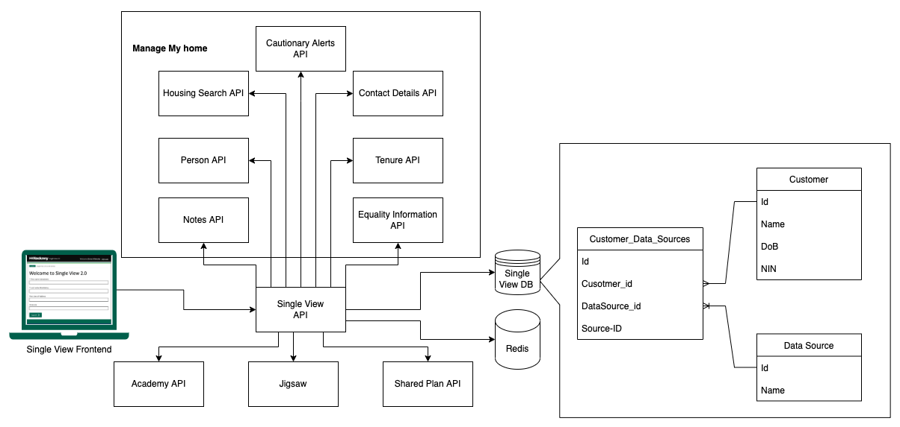

# LBH Single View API

Single view API is used for search residents across multiple systems.



### Data integrations used
| API                      | What data is retrieved                                                                                      |
|--------------------------|-------------------------------------------------------------------------------------------------------------|
| Housing search api       | Used for searching for resident in MMH                                                                      |
| Person API               | Used for retrieving resident information from MMH                                                           |
| Notes API                | Used for retrieving notes from MMH                                                                          |
| Contact Details API      | Used for retrieving contact details from MMH                                                                |
| Cautionary Alerts API    | Used for retrieving cautionary alerts from MMH                                                              |
| Equality Information API | Used for retrieving equality information from MMH                                                           |
| Tenure API               | Used for retrieving tenure information from MMH                                                             |
| Academy API              | Used for searching for residents, retrieving information and notes from the Council Tax and Benefits system |
| Jigsaw                   | Used for searching for residents, retrieving information and notes from the homelessness system             |
| Shared Plan              | Used for creating new and retrieving existing shared plans                                                  |

## Stack

- .NET Core as a web framework.
- nUnit as a test framework.

## Dependencies

- Redis
    - Redis is used for storing jigsaw auth tokens and credentials
- Postgress
    - Postgress is used for storing matched records

## Contributing

### Setup

1. Install [Docker][docker-download].
2. Install [AWS CLI][AWS-CLI].
3. Clone this repository.
4. Rename the initial template.
5. Open it in your IDE.

### Development

To serve the application, run it using your IDE of choice, we use Visual Studio CE and JetBrains Rider on Mac.

```bash
make setup
```

```bash
make serve
```

**Note**
When running locally the appropriate database conneciton details are still needed.
##### Postgres
For Postgres an approprate `CONNECTION_STRING` environment variable is needed,
and if you want to use a local Postgres instance then that will of course need to be installed and running.
##### DynamoDb
To use a local instance of DynamoDb, this will need to be installed. This is most easily done using [Docker](https://www.docker.com/products/docker-desktop).
Run the following command, specifying the local path where you want the container's shared volume to be stored.
```
docker run --name dynamodb-local -p 8000:8000 -v <PUT YOUR LOCAL PATH HERE>:/data/ amazon/dynamodb-local -jar DynamoDBLocal.jar -sharedDb -dbPath /data
```

If you would like to see what is in your local DynamoDb instance using a simple gui, then [this admin tool](https://github.com/aaronshaf/dynamodb-admin) can do that.

The application can also be served locally using docker:
```sh
$ make build && make serve
```

### Developing / Debugging the Jigsaw Integration
When sent a "Placeholder-Jigsaw-Token" RedisId (such as in the Single View Frontend when it is run locally), the API will return a default response, and will not contact Jigsaw's server for authentication.

In order to run the code contacting Jigsaw's server, you will need to ensure that the source (e.g. the frontend) sends a valid RedisId, encoded with the RSA public key.
This API can then decrypt it with the RSA private key, which must be set as an environment variable.
It will then contact Jigsaw's auth endpoint to obtain an authorisation header.

### NuGet Packages
At Hackney, we have created the NuGet Package to prevent the duplication of common code when implementing our APIs. Hence our NuGet packages will store the common code that can then be used in the relevant projects. For full details on the different features implemented within our packages please read [this ReadMe](https://github.com/LBHackney-IT/lbh-core/blob/release/README.md)

##### Using the package
For full details on how to use the package(s) within this repository please read
[this wiki page](https://github.com/LBHackney-IT/lbh-core/wiki/Using-the-package(s)-from-the-Hackney.Core-repository).

### Release process

We use a pull request workflow, where changes are made on a branch and approved by one or more other maintainers before the developer can merge into `master` branch.


Then we have an automated six step deployment process, which runs in CircleCI.

1. Automated tests (nUnit) are run to ensure the release is of good quality.
2. The application is deployed to development automatically, where we check our latest changes work well.
3. We manually confirm a staging deployment in the CircleCI workflow once we're happy with our changes in development.
4. The application is deployed to staging.
5. We manually confirm a production deployment in the CircleCI workflow once we're happy with our changes in staging.
6. The application is deployed to production.

Our staging and production environments are hosted by AWS. We would deploy to production per each feature/config merged into  `master`  branch.

### Creating A PR

To help with making changes to code easier to understand when being reviewed, we've added a PR template.
When a new PR is created on a repo that uses this API template, the PR template will automatically fill in the `Open a pull request` description textbox.
The PR author can edit and change the PR description using the template as a guide.

## Static Code Analysis

### Using [FxCop Analysers](https://www.nuget.org/packages/Microsoft.CodeAnalysis.FxCopAnalyzers)

FxCop runs code analysis when the Solution is built.

Both the API and Test projects have been set up to **treat all warnings from the code analysis as errors** and therefore, fail the build.

However, we can select which errors to suppress by setting the severity of the responsible rule to none, e.g `dotnet_analyzer_diagnostic.<Category-or-RuleId>.severity = none`, within the `.editorconfig` file.
Documentation on how to do this can be found [here](https://docs.microsoft.com/en-us/visualstudio/code-quality/use-roslyn-analyzers?view=vs-2019).

## Testing

### Run the tests

```sh
$ make test
```

To run database tests locally (e.g. via Visual Studio) and you are using Postgres the `CONNECTION_STRING` environment variable will need to be populated with:

`Host=localhost;Database=testdb;Username=postgres;Password=mypassword"`

Note: The Host name needs to be the name of the stub database docker-compose service, in order to run tests via Docker.

If changes to the database schema are made then the docker image for the database will have to be removed and recreated. The restart-db make command will do this for you.

### Agreed Testing Approach
- Use nUnit, FluentAssertions and Moq
- Always follow a TDD approach
- Tests should be independent of each other
- Gateway tests should interact with a real test instance of the database
- Test coverage should never go down
- All use cases should be covered by E2E tests
- Optimise when test run speed starts to hinder development
- Unit tests and E2E tests should run in CI
- Test database schemas should match up with production database schema
- Have integration tests which test from the PostgreSQL database to API Gateway


# Rotating Encryption keys

```bash
openssl genrsa -out rsa_dev_priv.pem
openssl rsa -pubout -in rsa_dev_priv.pem -out rsa_dev_pub.pem
```

Set the values without RSA padding where appropriate

## Data Migrations

### To create a new migration locally
Run:
```bash
dotnet restore
```

#### Dotnet Entity Framework installation
```bash
dotnet tool install -g dotnet-ef
```

#### Generate a new migration file
```bash
CONNECTION_STRING="Host=localhost;Port=5432;Database=testdb;Username=postgres;Password=mypassword" dotnet ef migrations add YourMigrationName
```

### To run migrations manually
Run in docker shell:
```bash
make shell
```

```bash
dotnet ef database update
```

### A good data migration
- Record failure logs
- Automated
- Reliable
- As close to real time as possible
- Observable monitoring in place
- Should not affect any existing databases

## Contacts

### Active Maintainers

- **Selwyn Preston**, Lead Developer at London Borough of Hackney (selwyn.preston@hackney.gov.uk)
- **Mirela Georgieva**, Lead Developer at London Borough of Hackney (mirela.georgieva@hackney.gov.uk)
- **Adam Tracy**, Junior Developer at London Borough of Hackney (adam.tracy@hackney.gov.uk)

[docker-download]: https://www.docker.com/products/docker-desktop
[universal-housing-simulator]: https://github.com/LBHackney-IT/lbh-universal-housing-simulator
[made-tech]: https://madetech.com/
[AWS-CLI]: https://aws.amazon.com/cli/
